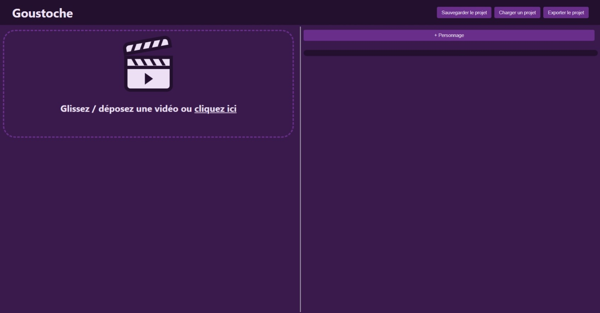
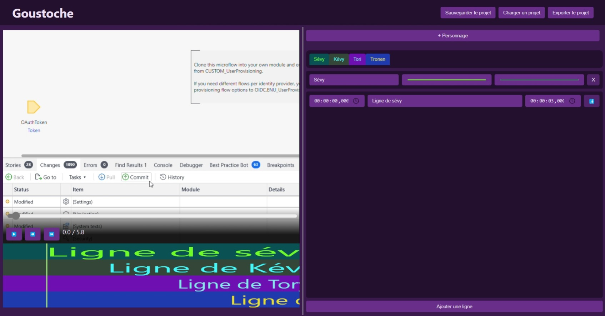

# goutsoche
> "hey i need a name for a lip-sync band kind-of generator, any idea"

> "sure, what about 'Gustave'?

> "yeah... that's a bit too AI shit assistant for my taste"

> "you can make a parody out of it, like Goustoche?

> "lmao okay deal *proceeds to make a typo in the project's name*

Goutsoche is a Svelte application that provides some tools to make your own lip-sync band! Add a video on the left side, some characters on the right side, and roll!

## screenshots
### empty

### with content

